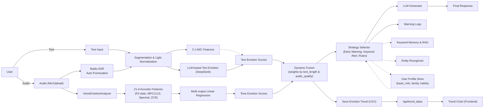
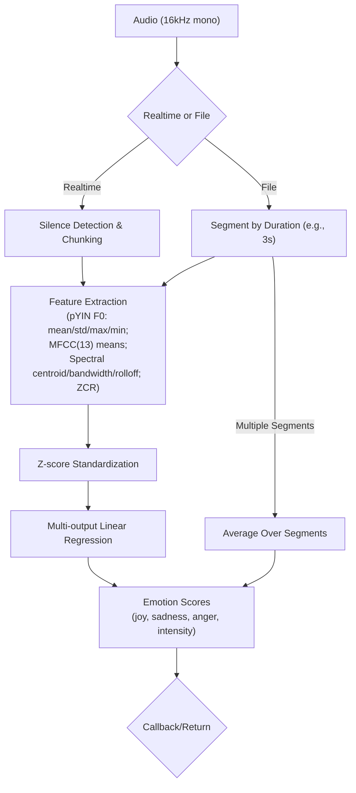
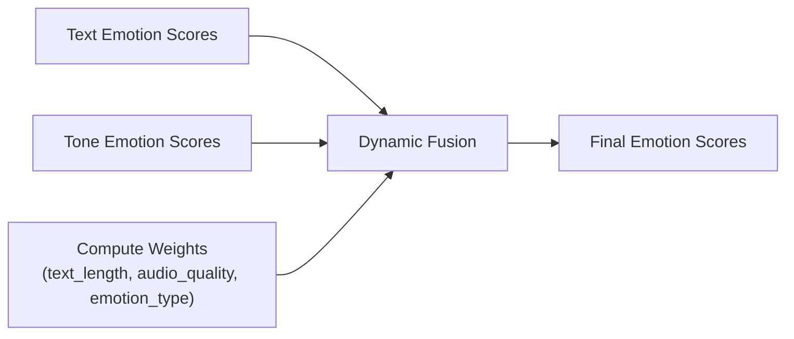
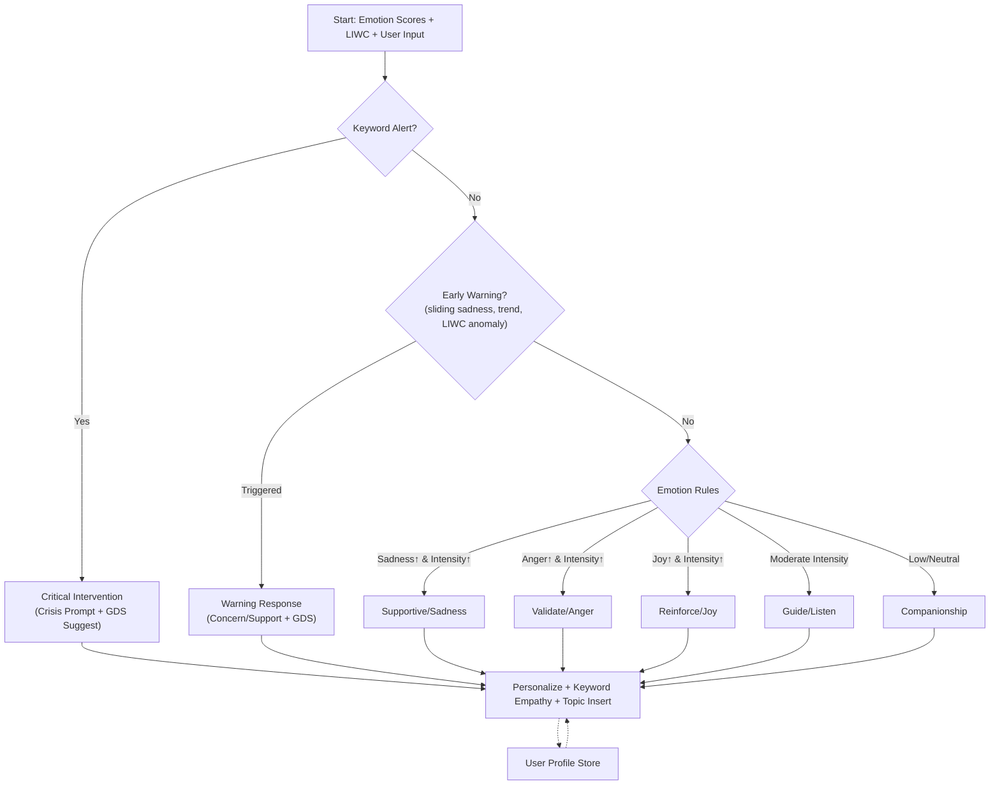
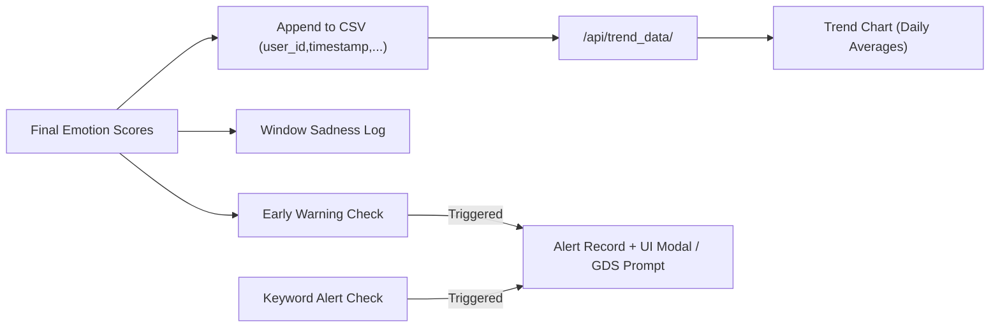

China has entered a period of demographic transition, marked by a third consecutive year of negative population growth by the end of 2024. The birth rate fell to 6.77%, with only 9.54% million newborns, while deaths exceeded 10.93 million (Lobanov-Rostovsky et al., 2023). This phenomenon suggests that the population aged 65 and above will more than double between 2020 and 2050-from 172 million (12.0%) to 366 million (26.0%)
	This rapid aging trend brings huge challenges for both families and society. With increasingly fragmented family structures and shifting caregiving norms, the burden of elder support is growing  (Wang, 2023). Although Chinese law mandates family responsibility for eldercare, the mental and emotional well-being of older adults remains largely neglected (Zhu, 2024). According to the 2024 China Report on Elder Mental Health, 23.75% of older adults report loneliness and 26.4% show symptoms of depression, while access to mental health resources remains scarce.
	This project introduces an emotion-aware conversational AI agent designed to provide scalable and accessible mental health support for Chinese elderly users. By combining emotion detection, dialogue strategy selection, and long-term trend monitoring, the system offers a low-cost, always-available emotion companion that is especially for older individuals who may suffer in silence.
	The rest of this paper is organized as follows: Section 2 reviews related work. Section 3 presents the system architecture and core modules. Section 4 describes the implementation details. Section 5 introduces the performance of the emotion classification trained. Then, Section 6 discusses the application of this agent and its limitations. Finally, Section 7 concludes the paper and outlines future directions.
Related Work
Emotion-Aware Dialogue Systems
Emotion-aware conversational agents designed to respond appropriately to a user's emotional state in an empathetic and trustworthy way. As demonstrated by Fitzpatrick et al.~\cite{fitzpatrick2017woebot} on Woebot and discussed by Possati~\cite{possati2023replika} for Replika, mobile chatbots have shown the feasibility of delivering emotionally supportive dialogue. Replika's use of personalization and mood mirroring, and Woebot's evidence-based cognitive behavioral dialogue, both show significant improvements in emotional well-being across user studies.
In the Chinese context, as detailed by Zhou et al.~\cite{zhou2020xiaoice}, Microsoft XiaoIce (小冰) represents one of the most architecturally complete emotion-aware agents to date. The XiaoIce system is structured into three main layers: the user interaction layer (handling front-end dialogue), the dialogue strategy layer, and the data layer. Within the strategy layer, two major components stand out. The dialogue manager governs state tracking and uses hierarchical policy routing to determine whether to invoke a ``skill'' or core chit-chat. The empathetic computing module is particularly important. It generates an emotional vector for each user utterance by extracting key affective dimensions such as emotion, intent, opinion, and inferred personality traits. This vector then conditions the generation or ranking of system responses, which enables XiaoIce to maintain long-term emotional alignment with users~\cite{zhou2020xiaoice}. While XiaoIce highlights the value of empathetic computing and long-term engagement, its full reranking and multimodal context stack is beyond the scope of small-footprint, rapid-cycle systems and thus serves here mainly as design inspiration rather than a directly replicated blueprint.
Transformer-based models have also been widely used for emotion recognition. Fine-tuning large pre-trained models like BERT, RoBERTa, or ERNIE on emotion classification tasks has become a standard method, which achieves high accuracy on benchmark datasets. For instancfe, the BERT-ERC model adapts BERT for conversation-level emotion classification and shows substantial performance gains over previous RNN-based systems. Beyond supervised fine-tuning, recent work explores zero-/few-shot affective inference with large language models (LLMs) that leverages prompt-based reasoning over conversational context to produce continuous emotion intensities and categorical labels. This approach improves adaptability in low-resource, real-time settings.
Mental Health Chatbots
Mental health chatbots differ from generic emotion-aware agents in a way that they incorporate therapeutic objectives, such as mood tracking, behavior change, or crisis mitigation, into their core functionality. Applications like Wysa, Ginger, and Youper utilize structured cognitive therapy frameworks embedded into natural dialogue. Evaluation studies reveal promising impacts on reducing anxiety and depressive symptoms, even though concerns remain regarding ethical design, data protection, and handling of crisis input. A notable academic system is SuDoSys by Chen et al.~\cite{chen2024structured}, which introduces stage-aware counseling with a stage-aware instruction generator, key information extraction, and stage control to guide transitions across counseling phases. This underscores the utility of staged objectives for psychologically grounded dialogue and motivates our use of hierarchical strategy logic.
In the Chinese ecosystem, services like 小冰 (XiaoIce) have partially addressed emotional needs but are often general-purpose. Recent LLM-based tools like 星野 (developed by MiniMax) and Emobot platforms are beginning to emphasize safety and psychological insight, whereas these remain under-evaluated in peer-reviewed literature.
Trend Analysis in Emotional Monitoring
While emotion detection in isolated dialogue turns is useful, long-term emotional trend tracking offers more valuable insights for mental health risk prediction. Techniques like emotion trajectory modeling, passive sensing, and behavioral analytics enable early warning systems.
Recent studies have combined mobile phone sensor data (sleep patterns, location entropy, physical activity) with machine learning models (e.g., transformers, HMMs) to forecast mood shifts and even predict suicidal ideation with high AUC scores. In China, wearable devices have been used to record movement under emotional induction, training classifiers to detect states like happiness or anger from accelerometer data alone.
In future development phases, we aim to incorporate a similar emotion trend monitoring module that aggregates multi-turn emotion scores and detects risk patterns (e.g., prolonged sadness). This module may integrate with basic alerting systems to inform caregivers or prompt user check-ins.
Multimodal Emotion Analysis
The role of multimodal inputs—text, audio, and visual features—is increasingly emphasized in emotion generation and recognition. Firdaus et al. (2022) proposed a conditional variational autoencoder (CVAE) with multimodal attention, trained to generate emotionally congruent responses using video dialogue data. Their work demonstrates that multimodal systems outperform unimodal baselines across diversity and emotional accuracy metrics.
Despite these advances, Chinese-language psychological systems rarely leverage multimodal inputs. Emotion detection is still primarily performed on text, limiting depth and subtlety. This gap is critical in older adult interactions, where tone and non-verbal cues may carry more affective weight than literal content.
We have already incorporated an audio modality via pitch- and timbre-based voice emotion analysis tailored to elderly speech. In future work, we plan to extend to full audiovisual corpora such as CH-SIMS by Yu et al.~\cite{yu2020chsims} to integrate visual cues in order to imporve accuracy in cases of mixed affect or implicit emotions.
System Design and Architecture

Figure 1. System architecture and data flow (text/audio input, dual-path emotion, fusion, strategy, UI/storage).

The system is designed to enable emotionally intelligent dialogue tailored for elderly users through multimodal inputs (voice and text), real-time emotion analysis, personalized dialogue strategies, and long-term emotional state monitoring. The architecture follows a modular design that integrates audio processing, dual-path emotion analysis, hierarchical rule-based strategy selection, large language model (LLM) response generation, and persistent memory, offering empathetic, safe, and personalized companionship.
User input is collected via three primary channels: real-time microphone streaming (dependent on local PyAudio availability), fixed-duration recordings, and uploaded audio or text. ASR is provided by Baidu’s cloud API (Baidu AI Speech, n.d.) [https://ai.baidu.com/tech/speech]. To address the linguistic characteristics typical of elderly speech, such as colloquial fragments, dialectal influence, and speech recognition (ASR) errors, the system incorporates a sentence segmentation and normalization module. This module utilizes Baidu’s speech recognition API with automatic punctuation to identify natural sentence boundaries, which are then refined through regular expressions and fallback heuristics to handle running punctuation, fillers, and truncated utterances while preserving emotional context. Normalization corrects homophones, converts spoken forms to standard written equivalents, and removes meaningless repetitions or fillers, which thereby ensures high-quality input for downstream emotion analysis. Although the current ASR model primarily supports Mandarin, future versions will address dialect-specific recognition.
Emotion recognition adopts a hybrid approach: (1) a lexicon-based pathway (C-LIWC) that extracts psychologically interpretable features (negemo, social, cogproc, self-reference), (2) an LLM-based pathway (e.g., DeepSeek) that performs zero-shot inference over the current utterance and recent dialogue history to output continuous-valued emotion intensities and labels, and (3) a voice pathway that analyzes pitch and timbre (MFCC means, spectral centroid, spectral bandwidth, spectral rolloff, zero-crossing rate). For model reliability, we also trained and evaluated an offline stacking ensemble (MLP, LightGBM, Ridge with a linear meta-learner) on synthetic eldercare dialogues; at runtime, the default text pathway is LLM-based, while the voice pathway runs in parallel and is fused with text via dynamic weighting. The proposed voice emotion detection module is a feature-driven, regression-based framework that integrates psychoacoustic principles with machine learning for robust emotional state estimation.

Figure 2. Voice processing pipeline and acoustic feature extraction to regression outputs.
 The system first extracts a 21-dimensional acoustic feature vector from each audio segment, comprising four pitch-related features—mean, standard deviation, maximum, and minimum pitch—and seventeen timbre-related features, including thirteen Mel-Frequency Cepstral Coefficients (MFCC) mean values, spectral centroid, spectral bandwidth, spectral roll-off, and zero crossing rate (McFee et al., 2015; Mauch & Dixon, 2014; Davis & Mermelstein, 1980; Tzanetakis & Cook, 2002). These features jointly capture the prosodic and spectral characteristics that reflect emotional tone, intensity, and variability, and are then standardized using Z-score normalization to ensure equal weighting during model training.
Given the absence of professionally annotated datasets, a psychoacoustically-informed synthetic data generation strategy was adopted to produce 200 training samples. Rather than assigning arbitrary feature–emotion mappings, this process is grounded in established research on vocal emotion expression and prosody–emotion relations (Scherer, 2003). For instance, joy is modeled through elevated pitch and increased spectral brightness, sadness through reduced pitch variability and diminished spectral energy, and anger through heightened pitch fluctuations and increased zero crossing rate. Emotional intensity follows the peak emotion principle, where overall activation is determined by the strongest individual emotion component.
The prediction stage employs a multi-output regression framework in which independent linear regression models are trained for each emotional dimension. This design enables the detection of complex mixed emotional states while preserving interpretability through direct analysis of model coefficients. The low computational complexity supports real-time inference, and the modular structure allows straightforward extension to additional emotional dimensions. Training progress is monitored using Mean Squared Error, ensuring both convergence and the validity of the synthetic data approach.
Finally, the module is integrated into the larger multi-modal emotion recognition pipeline alongside text-based emotion analysis. Voice-based scores undergo dynamic weight adjustment according to audio quality and contextual conditions, which aligned with multimodal fusion practices (Baltrušaitis, Ahuja, & Morency, 2019).

Figure 3. Dynamic fusion of text and tone emotion scores with adaptive weights.

The strategy selection module utilizes a hierarchical, rule-based framework guided by psychological relevance and user safety.

Figure 4. Hierarchical strategy selection: keyword alert, early warning, rule-based response, and personalization.
 At the highest level, sustained sadness detected across three consecutive sliding windows triggers an early warning mechanism and prompts human intervention. Aberrant LIWC patterns (e.g., prolonged high negemo scores and reduced social engagement) represent indicators of possible depressive states and initiate risk alerts. In the absence of detected risk, emotion-dominant rules determine the system’s response strategy: joy is met with positive reinforcement, anger with validation and calm acknowledgement, mixed or ambivalent emotions with clarification and support, and emotionally neutral content with reminiscence or gentle companionship. A fallback strategy ensures emotionally engaging dialogue even when no dominant rule applies.
Each strategy is further filtered for semantic coherence by leveraging a multilingual MiniLM embedding model to match the user input with appropriate dialogue topics from a curated keyword memory and trigger corpus. This semantic alignment avoids generic or irrelevant responses and promotes personalized, topic-relevant engagement. Final outputs integrate remembered user-specific keywords and empathetic prompts to ensure emotionally warm and relevant interactions.
To support long-term emotional tracking, the system continuously aggregates and visualizes daily averages of sadness, joy, and anger scores, as well as the frequency of triggered alerts. This timeline view of emotional trends enables monitoring of persistent distress patterns, such as long-term sadness or social withdrawal, and enhances the accuracy of risk detection across sessions.

Figure 5. Long-term trend chart pipeline and alert triggers (early warning and keyword alert).

Additionally, a self-assessment questionnaire module is embedded in the main interface, which allows users to initiate a check-in on their current emotional state at any time. The questionnaire is also prompted during emotional alerts, offering users a structured and respectful way to reflect and report their emotional condition. Specifically, we use the 15-item Geriatric Depression Scale (GDS-15) for the questionnaire, which is widely used and validated for detecting depressive symptoms in older adults (Sheikh & Yesavage, 2012). By integrating this scale, the system ensures both clinical relevance and user accessibility in detecting potential depressive states.
Finally, the system features a user information management framework with privacy-first design. Personal information is logically separated across user profiles, with basic details (e.g., name, age, number of children) collected at account creation via minimal input. Further enrichment occurs organically through dialogue-based questioning and user-initiated edits on the profile page. This data serves both personalization and safety purposes, which enables the system to tailor responses and maintain user context across sessions.
 
Module Implementation
Input processing is managed through the BaiduSpeechRecognizer class, which interfaces with Baidu’s ASR services. Live speech is captured by PyAudio in 16kHz mono mode, and silent detection based on audio energy is applied to segment the utterance into streaming transcription.  Recognition results are returned asynchronously through threading and queues to minimize latency and accommodate the slow, intermittent speech patterns typical of elderly users. Fixed-duration recordings are saved as temporary WAV files before batch transcription. Audio files and direct text inputs are fed through a processing pipeline that performs sentence segmentation and metadata tagging.
Sentence segmentation primarily relies on Baidu’s automatic punctuation insertion feature, with light post-processing to consolidate repeated punctuation and preserve meaningful speech fragments (including fillers and dialect expressions). Normalization rules (e.g., homophone correction, spoken-to-written mappings, regex-based de-duplication) are considered for future enhancement. Dialectal inputs currently utilize the Mandarin model (dev_pid=1537).
Emotion recognition combines two complementary approaches: C-LIWC extracts linguistically interpretable features across categories such as negemo, social, cogproc, and self-focus. These features have been widely validated in psychological and computational studies (Tausczik & Pennebaker, 2010). In the Chinese context, a localized version C-LIWC was used to ensure linguistic compatibility and cultural relevance (Huang et al., 2012). In the meantime, a text emotion pathway uses an LLM-based classifier (DeepSeek, 2023) to produce continuous-valued emotion intensity scores. Separately, we trained an offline stacking ensemble (MLP, LightGBM, Ridge; linear regression as meta-learner) to improve consistency; these results are reported in Evaluation, while the runtime pipeline defaults to the LLM pathway.
Voice emotion detection operates in parallel with text analysis via a dedicated module that extracts a 21-dimensional acoustic feature vector (4 pitch features and 17 timbre features: MFCC means, spectral centroid, bandwidth, rolloff, zero-crossing rate). Features are standardized and fed to a multi-output linear regression model trained on 200 psychoacoustically informed synthetic samples (high pitch + bright timbre → joy; low variability + flatter prosody → sadness; high pitch variability + frequent spectral changes → anger; intensity = max component). Voice and text scores are reconciled through dynamic weighting informed by text length, audio quality, and salient emotion type to produce final emotion estimates.
The strategy selection component adopts a four-layer hierarchical decision tree: early warning detection employing sliding window sadness thresholds; LIWC anomaly detection signaling depressive-like states; emotion dominance rules for joy, anger, mixed emotion, and neutral states; and a companionship fallback. Semantic similarity between strategy prompts and user input is computed using MiniLM‑v2 embeddings (Wang et al., 2020; Wang et al., 2021) alongside SBERT-style sentence embeddings (Reimers & Gurevych, 2019), with a threshold of 0.45 to preserve contextual relevance. Strategy prompts are filled dynamically with stored user keywords and safe elderly topics with compassionate prompt templates that encourage LLMs to respond warmly and in personalized styles.
The long-term tracker module retains emotion time series and keyword memories, It monitors out-of-norm trends and prolonged emotional duration. This helps provide automated alert flags for recommending caregiver intervention when necessary. The central controller integrates input acquisition, module operation, and output composition, maintaining session-specific memory states and keeping modularity so that future extension or component substitution is possible.
In addition to passive emotion tracking, a questionnaire module is embedded into the main interface to allow users to self-report their current emotional state at any time. The questionnaire is implemented as a lightweight web component and is prompted during high-risk alerts; users can also trigger it manually. Results are stored alongside model-inferred scores to support multimodal trend validation.
A user profile management module ensures data separation and personalization. Core user information (e.g., age, name, family structure) is initialized at account creation through minimal input, and enriched over time via natural dialogue extraction and user interface entry. All user data is managed through a secure profile storage mechanism and used to personalize dialogue generation and risk assessment without compromising privacy.

Concretely, the profile manager implements (i) dual storage backends with automatic fallback (MongoDB → JSON files), (ii) dialogue logging linked to user_id with emotion snapshots, (iii) a lightweight question strategy that triggers after ≥3 rounds only when topically relevant and naturally integrable (15% chance), and (iv) structured updates to fields such as children_count, spouse_status, living_alone, hobbies, and health_status. These data are read during strategy personalization and appended back after each turn to maintain long‑term context.
 
Evaluation
Even though the implementation of the LLM in the emotion recognition module performs well, it still has several drawbacks such as lack of interpretability and difficulty ensuring output consistency. Therefore, as an improvement, we trained an emotion classification model to directly classify emotions instead.
We generated a comprehensive emotion recognition dataset with 10,000 elder care dialogue samples through rigorous prompting of the LLM. Each sample contains multi-turn conversations annotated with emotion labels across four dimensions: anger, sadness, joy, and emotional intensity. A BERT-based Chinese text embedding model is then employed to capture contextual semantic information from the dialogue turns. The input features include:
Text embeddings: 768-dimensional BERT representations
Emotion features: Domain-specific emotional indicators
Maximum dialogue turns: 7
For model training, a stacking ensemble approach combining three diverse base models is adopted: Multi-Layer Perceptron (MLP), Gradient Boosting Models, and Ridge Regression. A meta-learner, implemented as linear regression with scikit-learn (Pedregosa et al., 2011), optimally combines the predictions from these base models to produce the final emotion scores.
	We evaluated model performance using MSE for regression accuracy and AUC-ROC for binary classification for each emotion. In this setup, a lower MSE indicates more accurate emotion score predictions, while a higher AUC-ROC indiacates better discrimination between presence/absence of an emotion. We adopted a stacking ensemble combining three diverse base learners (MLP, LightGBM (Ke et al., 2017), and Ridge regression) with a linear regression meta-learner. 
 
Overall Performance Comparison

| Model              | MSE    | Avg AUC-ROC |
|--------------------|--------|-------------|
| MLP                | 0.0555 | 0.7430      |
| LightGBM           | 0.0191 | 0.9093      |
| Ridge              | 0.0191 | 0.9093      |
| Stacking Ensemble  | 0.0192 | 0.9094      |

 
Detailed comparisons across emotional dimensions
 
| Emotion   | Model               | MSE     | AUC-ROC |
|-----------|---------------------|---------|---------|
| Anger     | MLP                 | 0.0223  | 0.9285  |
|           | LightGBM            | 0.0066  | 0.9852  |
|           | Ridge               | 0.0066  | 0.9852  |
|           | Stacking Ensemble   | 0.0066  | 0.9852  |
| Sadness   | MLP                 | 0.0674  | 0.6986  |
|           | LightGBM            | 0.0234  | 0.9322  |
|           | Ridge               | 0.0234  | 0.9322  |
|           | Stacking Ensemble   | 0.0234  | 0.9323  |
| Joy       | MLP                 | 0.1053  | 0.7545  |
|           | LightGBM            | 0.0339  | 0.9041  |
|           | Ridge               | 0.0339  | 0.9041  |
|           | Stacking Ensemble   | 0.0339  | 0.9047  |
| Intensity | MLP                 | 0.0272  | 0.5903  |
|           | LightGBM            | 0.0126  | 0.8158  |
|           | Ridge               | 0.0126  | 0.8158  |
|           | Stacking Ensemble   | 0.0127  | 0.8156  |
 
In terms of overall performance, the LightGBM and Ridge models individually achieved the lowest overall MSE (0.0191) and the highest average AUC-ROC (0.9093). Our stacking ensemble closely matched these results (MSE 0.0192, AUC 0.9094) while significantly outperforming the MLP baseline (MSE 0.0555, AUC 0.7430). In other words, the ensemble method preserved the top-tier accuracy of LightGBM/Ridge while dramatically reducing the error compared to MLP. This outcome aligns with prior findings that stacking can offer “superior predictive power” and precision in emotion recognition (Al Shamsi & Abdallah, 2023).
In summary, our stacking ensemble achieved consistently strong results across all emotion dimensions. In each case it matched or slightly exceeded the best base model’s performance, which confirms the benefit of ensemble learning in emotion classification. The low MSE values (e.g. 0.0066 for anger) indicate highly precise score predictions, and the high AUCs (up to 0.985) show robust classification. These results improve upon the simpler MLP baseline by a large margin and align with recent studies where stacking classifiers “outperform other models in accuracy and performance” in text-based emotion detection.
Discussion
From a system-level perspective, and building upon the integrated module architecture and training procedures described above, our Eldercare Agent delivers psychologically informed multimodal processing, coherent conversation management, and persistent long-term emotion tracking. To address user isolation, the agent also safeguards user information and provides a personalized interaction experience. Rather than treating all modules as isolated components, the system orchestrates them into a coherent decision pipeline that balances redundancy, interpretability, and adaptability. This pipeline enables the agent to respond in real time to the nuanced and often fragmented conversational patterns of elderly users while preserving awareness of long-term emotional trends. The system’s hierarchical strategy logic ensures that urgent emotional risks are prioritized without neglecting everyday companionship needs. Long-term emotional tracking further acts as a safeguard, enabling escalation when sustained deviations from baseline are observed. This integrated design moves beyond the performance of any single module, demonstrating how cross-module coordination enhances reliability, contextual relevance, and user trust. By aligning computational processing with psychological principles, the Eldercare Agent maintains emotional coherence across both short-term interactions and extended engagement, serving as an effective companion for older adults living alone, particularly in the Chinese context where family structures are becoming increasingly nuclear and adult children may have limited capacity to provide direct companionship.
Compared with existing Chinese-language emotion and conversational AI products, our system is differentiated by its explicit elderly focus and its design choices tailored to this demographic. Most current sentiment analysis and companion platforms target younger or general audiences, drawing on data from social media or short-form conversations that do not reflect the linguistic patterns, slower pacing, and cognitive considerations of elderly users. In contrast, our architecture incorporates psychologically grounded decision-making, persistent long-term emotion tracking, and a hierarchical strategy pipeline that blends rule-based safety with adaptive LLM responses. Unlike many competing products that are text-first, the agent supports voice-first interaction with live, silence-aware speech transcription, accommodating the fragmented or intermittent speech styles typical of older adults. Personalization is further enhanced through keyword memory, which dynamically integrates user-specific topics into strategy prompts, a feature rarely found in existing offerings. Finally, the modular but tightly coordinated architecture ensures that individual components—such as ASR, emotion detection, or strategy selection—can be upgraded independently without disrupting the overall coherence of the system, providing a level of adaptability uncommon in current commercial products.
Despite these strengths, several challenges remain before the system can be productized. Foremost among these is the slow response time caused by the lack of access to commercial APIs, which prevents the agent from providing truly instantaneous replies and results in a less fluid user experience. For voice input, the system currently lacks dialectal ASR capabilities, as there is no open-source speech recognition model trained on a sufficiently broad set of Chinese regional accents. This is a significant barrier, since many elderly users have received limited formal education and communicate primarily in local dialects. Such limitations also raise questions about the system’s target user group—specifically, which segments of the elderly population are both open to AI-based interaction and capable of using a mobile application.
Emotion detection accuracy can also be improved with real-world conversational data. Currently, there is no publicly available dataset focused on elderly dialogue and most existing corpora are drawn from social media platforms used by younger people, containing only short exchanges with limited coherence. Synthetic data generated for training may therefore fail to fully capture the conversational characteristics of elderly users. Additionally, while the parallel use of C-LIWC and the ensemble emotion model provides diverse insights, the two methods currently operate independently, each determining only part of the strategy selection process. Designing a mechanism for their outputs to complement each other remains an open challenge. The emotional dimensions we currently track—joy, sadness, anger, and overall emotional intensity—may also be insufficient to capture the full spectrum of affective states relevant to detecting depression risk in elderly populations.
The conversation strategy module warrants further refinement. Its current hierarchical design prioritizes high sadness scores for triggering alerts, followed by LIWC anomaly detection, then emotion-dominance rules for anger, joy, and mixed emotions, with a fallback mechanism handling residual cases. Given that the strategy selection module also integrates keyword memory, prompts to the LLM can become overly dense, potentially diluting conversational clarity. Optimizing the inputs to this module in tandem with improvements to the emotion detection component is therefore a priority. Regarding keyword memory itself, the current implementation relies on semantic similarity to trigger related topics from a limited corpus; expanding the corpus and refining the logic could significantly enhance topic recall. Finally, prompt optimization for the LLM remains an ongoing task, with the goal of better defining the AI’s persona and conversational boundaries in a way that is both engaging and safe for elderly users.
 
	
 
Next Steps
The immediate next stage of development will focus on addressing the limitations identified above. Priority will be given to optimizing the agent’s response latency by refining the model invocation pipeline and exploring more efficient inference pathways in the absence of commercial API access. Concurrently, dialectal ASR capabilities will be pursued through the collection and integration of accented Chinese speech data, enabling the system to serve elderly users who rely primarily on regional dialects. For voice emotion detection, we plan to synthesize larger-scale training corpora and collect small pilot datasets to better supervise pitch/timbre–emotion mapping, enabling stronger regression or lightweight neural models (e.g., polynomial regression, gradient boosting, shallow CNNs over spectrograms). Enhancements to text emotion detection will involve acquiring or constructing a more representative elderly dialogue dataset, as well as designing a tighter fusion mechanism between the C-LIWC and LLM pathways (and the offline ensemble) to produce complementary, unified outputs. The conversation strategy module will also be refined by streamlining its input structure, expanding the keyword memory corpus, and iteratively testing prompt formulations to ensure the LLM maintains clarity, relevance, and a well-defined companion persona.
In parallel with these functional improvements, we plan to develop a high-fidelity user interface prototype using Figma, focusing on accessibility and simplicity to accommodate older users with limited digital literacy. The UI will be designed to minimize cognitive load, offer clear interaction cues, and provide multi-modal feedback, aligning with the psychological and usability considerations embedded in the back-end architecture.
We acknowledge that certain aspects—particularly those involving secure data storage, compliance with high-level software and data protection regulations, and large-scale data collection—are unlikely to be completed within the current development cycle. Nevertheless, these remain essential long-term objectives, and future iterations of the Eldercare Agent will work toward meeting these requirements while preserving the system’s core values of safety, personalization, and psychological sensitivity.

Citation
Lobanov‑Rostovsky, G. (2023). Growing old in China in socioeconomic and epidemiological context: Systematic review of social care policy for older people. BMC Public Health. Retrieved from https://bmcpublichealth.biomedcentral.com/
Wang, X. X. (2023). 家庭现代化背景下失能老人家庭养老困境与支持政策研究 [Master’s thesis, 吉林大学]. CNKI. https://doi.org/10.27162/d.cnki.gjlin.2023.000763
Zhu, J. M. (2024). 论我国老年人精神赡养权的法律保障 [Master’s thesis, 贵州大学]. CNKI. https://doi.org/10.27047/d.cnki.ggudu.2024.002124
Fitzpatrick, K. K., Darcy, A., & Vierhile, M. (2017). Delivering cognitive behavior therapy to young adults with symptoms of depression and anxiety using a fully automated conversational agent (Woebot): A randomized controlled trial. JMIR Mental Health, 4(2), e7785. https://doi.org/10.2196/mental.7785
Possati, L. M. (2023). Psychoanalyzing artificial intelligence: The case of Replika. AI & Society, 38(4), 1725–1738. https://doi.org/10.1007/s00146-023-01644-1
Zhou, L., Gao, J., Li, D., & Shum, H.-Y. (2020). The design and implementation of XiaoIce, an empathetic social chatbot. Computational Linguistics, 46(1), 53–93. https://doi.org/10.1162/coli_a_00368
Chen, Y., Zhang, X., Wang, J., Xie, X., Yan, N., Chen, H., & Wang, L. (2024). Structured Dialogue System for Mental Health: An LLM Chatbot Leveraging the PM+ Guidelines. In Social Robotics (ICSR + InnoBiz 2024) (Lecture Notes in Computer Science, Vol. 15170, pp. 262–271). Springer. https://doi.org/10.1007/978-981-96-1151-5_27 themoonlight.io+10link.springer.com+10arxiv.org+10
Firdaus, M., Chauhan, H., Ekbal, A., & Bhattacharyya, P. (2022). EmoSen: Generating sentiment and emotion controlled responses in a multimodal dialogue system. IEEE Transactions on Affective Computing, 13(3), 1555–1566. https://doi.org/10.1109/TAFFC.2020.3015491
Yu, W., Xu, H., Meng, F., Zhu, Y., Ma, Y., Wu, J., Zou, J., & Yang, K. (2020). CH‑SIMS: A Chinese Multimodal Sentiment Analysis Dataset with Fine‑grained Annotation of Modality. In Proceedings of ACL 2020 (pp. 3718–3727). https://aclanthology.org/2020.acl-main.343/ https://doi.org/10.18653/v1/2020.acl-main.343
Baidu AI Speech. (n.d.). Speech recognition products & documentation. https://ai.baidu.com/tech/speech
Tausczik, Y. R., & Pennebaker, J. W. (2010). The psychological meaning of words: LIWC and computerized text analysis methods. Journal of Language and Social Psychology, 29(1), 24–54. https://doi.org/10.1177/0261927X09351676
Huang, X. T., Liao, Q. S., & Huang, P. (2012). Development of the Chinese version of the LIWC and its reliability and validity. Acta Psychologica Sinica, 44(11), 1402–1412. https://doi.org/10.3724/SP.J.1041.2012.01402
DeepSeek. (2023). DeepSeek LLM: Scalable language models with high performance. Retrieved July 26, 2025, from https://github.com/deepseek-ai/DeepSeek-LLM
Wang, W., Bao, H., Huang, S., Dong, L., & Wei, F. (2020/2021). MiniLMv2: Multi‑Head Self‑Attention Relation Distillation for Compressing Pretrained Transformers. arXiv:2012.15828. https://doi.org/10.48550/arXiv.2012.15828
Reimers, N., & Gurevych, I. (2019). Sentence‑BERT: Sentence Embeddings using Siamese BERT‑Networks. EMNLP. https://doi.org/10.48550/arXiv.1908.10084
McFee, B., Raffel, C., Liang, D., Ellis, D. P. W., McVicar, M., Battenberg, E., & Nieto, O. (2015). librosa: Audio and Music Signal Analysis in Python. In Proceedings of the 14th Python in Science Conference (pp. 18–25).
Mauch, M., & Dixon, S. (2014). pYIN: A fundamental frequency estimator using probabilistic threshold distributions. In ICASSP (pp. 659–663).
Davis, S., & Mermelstein, P. (1980). Comparison of parametric representations for monosyllabic word recognition in continuously spoken sentences. IEEE Trans. Acoustics, Speech, and Signal Processing, 28(4), 357–366.
Tzanetakis, G., & Cook, P. (2002). Musical genre classification of audio signals. IEEE Trans. Speech and Audio Processing, 10(5), 293–302.
Scherer, K. R. (2003). Vocal communication of emotion: A review of research paradigms. Speech Communication, 40(1–2), 227–256.
Baltrušaitis, T., Ahuja, C., & Morency, L.-P. (2019). Multimodal Machine Learning: A Survey and Taxonomy. IEEE TPAMI, 41(2), 423–443.
Sheikh, J. I., & Yesavage, J. A. (2012). Geriatric Depression Scale—Short Form [Dataset]. https://doi.org/10.1037/t01786-000
Pedregosa, F., Varoquaux, G., Gramfort, A., et al. (2011). Scikit-learn: Machine Learning in Python. JMLR, 12, 2825–2830.
Ke, G., Meng, Q., Finley, T., Wang, T., Chen, W., Ma, W., Ye, Q., & Liu, T.-Y. (2017). LightGBM: A Highly Efficient Gradient Boosting Decision Tree. NeurIPS 2017. https://github.com/microsoft/LightGBM
Al Shamsi, A. A., & Abdallah, S. (2023). Ensemble Stacking Model for Sentiment Analysis of Emirati and Arabic Dialects. [ScienceDirect]. https://www.sciencedirect.com/science/article/pii/S1319157823002458
